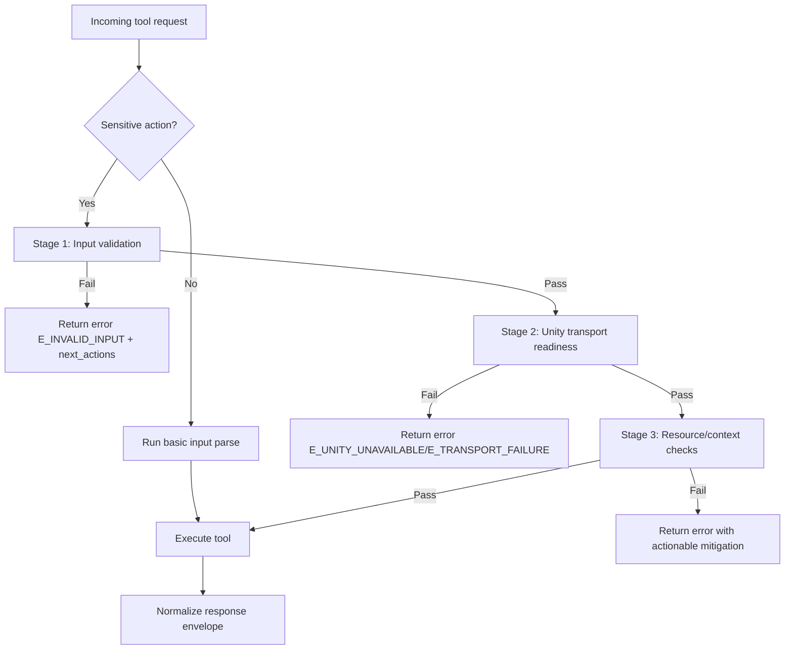

# Verification Loop Policy (Week 3 SoT)

## Goal
Define a preflight verification loop for sensitive operations so failures become predictable, actionable, and safe before Unity-side mutation occurs.

## Scope
This policy applies to server-side wrappers before calling Unity transport for sensitive flows:
- Script mutation: `script_apply_edits`, `manage_script` (`create`, `rename`, `delete`)
- Scene mutation: `manage_scene` (`load`, `create`, `create_with_objects`, `remove_from_build`)
- High-impact project operations: `manage_packages` (`install`, `remove`, `update`)

Read-only actions (`list`, `get`, `get_current`, `get_methods`, `get_properties`) are out of scope by default.

## Verification stages

1. **Input validation**
   - Required fields present
   - Action belongs to allowed enum
   - Paths and names follow expected format
   - Failure maps to `E_INVALID_INPUT`

2. **Transport and Unity readiness**
   - Unity bridge reachable
   - Target Unity instance resolvable
   - Failure maps to `E_UNITY_UNAVAILABLE` or `E_TRANSPORT_FAILURE`

3. **Resource and context checks**
   - Target script/scene/package exists when action requires existing resource
   - Target does not already exist for create-like actions
   - Failure maps to `E_INVALID_INPUT` (missing/invalid target) or `E_INTERNAL` (unexpected resolver failure)

4. **Execution gate decision**
   - If all checks pass: execute tool
   - If check fails: return canonical `error` envelope with `next_actions`
   - If uncertain but safe to defer: return `pending` with retry hint (rare; mainly for transient bridge state)

## Trigger conditions
Run verification loop when any of the following is true:
- Action mutates script files
- Action mutates scene state or build settings
- Action changes package dependency graph
- Action is marked as `sensitive=true` in future tool metadata

## Skip conditions
Skip full verification loop when all are true:
- Action is explicitly read-only
- Request has no side-effect potential
- No cross-resource dependency is required

Even on skip, basic input parsing still applies.

## Decision flow

## Response contract alignment
All verification failures must return canonical envelope from Week 1 contract:
- `status=error`
- `error.code` in `E_*|W_*`
- `next_actions` with concrete remediation

For transient failures, set `retryable=true` only when retry is meaningful (`E_TIMEOUT`, `E_TRANSPORT_FAILURE`).

## Logging requirements
For sensitive actions, include these trace fields in server logs:
- `tool`
- `action`
- `verification_stage`
- `verification_result` (`pass|fail|skip`)
- `error_code` (if failed)

Do not include full script content or secrets in logs.

## Minimal rollout plan (Day 16 input)
1. Add a preflight helper in `Server/src/services/tools/utils.py`.
2. Integrate helper into `script_apply_edits`, `manage_script`, `manage_scene`, `manage_packages` wrappers.
3. Add baseline tests for pass/fail/skip paths.